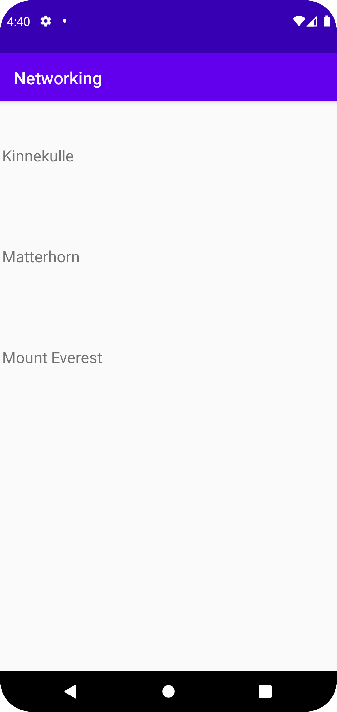

# Rapport

Den till layout.xml har skapats med en recyclerView, så att text- och recyclerView finns i två olika layouts. En class med mountain har skapats som ska ta fram namn på berg genom 
en URL som finns i MainActivity. En RecyclerViewAdapter skapades för att kunna koppla ihop Mountain-klassen med RecyclerViewn. Interet-acess har enableats så att datan kan hämtas från URLen.
I onPostExecute har gson lagts till för att json-datan ska kuna skrivas ut och synas, så att bergens namn syns på skärmen.

I första kodsnutten kan man se hur mountain-classen har gjorts, och att endast namn från bergen ska synas. Med hjälp av gson kommer json-datan kunna synas på skärmen.
```
import com.google.gson.annotations.SerializedName;
public class Mountain {
    @SerializedName("name")
    private String name;
    public Mountain(String name){
        this.name=name;
    }
    public String getName(){
        return name;
    }
    public void setName(String name){
        this.name=name;
    }
    @Override
    public String toString(){
        return name;
    }
    public String getTitle(){
        return name;
    }
}

```

Bilder läggs i samma mapp som markdown-filen.



Läs gärna:

- Boulos, M.N.K., Warren, J., Gong, J. & Yue, P. (2010) Web GIS in practice VIII: HTML5 and the canvas element for interactive online mapping. International journal of health geographics 9, 14. Shin, Y. &
- Wunsche, B.C. (2013) A smartphone-based golf simulation exercise game for supporting arthritis patients. 2013 28th International Conference of Image and Vision Computing New Zealand (IVCNZ), IEEE, pp. 459–464.
- Wohlin, C., Runeson, P., Höst, M., Ohlsson, M.C., Regnell, B., Wesslén, A. (2012) Experimentation in Software Engineering, Berlin, Heidelberg: Springer Berlin Heidelberg.
